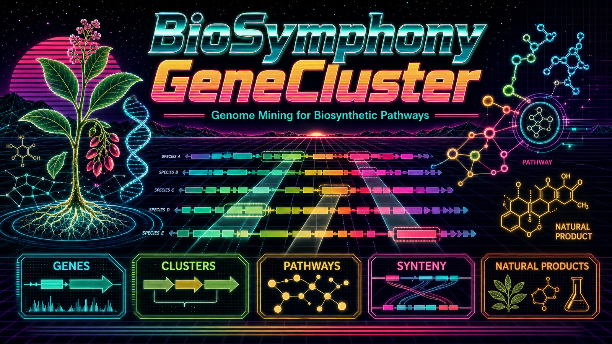

# BioSymphony GeneCluster

[](https://github.com/BioSymphony/biosymphony-genecluster/actions/workflows/public-release-check.yml)
[](LICENSE)
[](CITATION.cff)
[](docs/agent-orchestrator-guide.md)



**Agent-native genome mining for natural products: turn molecule or pathway goals into biosynthetic gene-cluster discovery campaigns.**

BioSymphony GeneCluster turns a pathway, target molecule, or biosynthetic gap into a genome-mining campaign. You point Claude Code, Codex, Symphony, or your preferred agent at the biological question, and the agent scouts public plant, fungal, and microbial genomes and transcriptomes, searches for candidate genes, anchors hits in genomic context, compares synteny across species, predicts enzyme function, detects gene clusters, and maps the evidence back to plausible natural-product pathways.

A request like *"find the benzylisoquinoline alkaloid gene cluster in Berberis vulgaris using Coptis chinensis as the canonical reference,"* *"assemble pathway evidence for a target molecule starting from Coptis chinensis and three Coptis relatives,"* or *"fill the missing step in this terpene pathway using Solanaceae candidates"* becomes a multi-stage, multi-agent mission the agent can carry through to a defensible answer. The same artifact contracts work whether a solo agent is running on a laptop or a multi-issue Linear DAG is fanning out across cloud GPUs.

The skill supplies source scouts, query and control ledgers, route cards, candidate-search contracts, genome-context capture, BGC and function-jury integration, and reviewable pathway outputs.

## How A Session Looks

You open this repo in Claude Code, Codex, or Symphony. You tell your agent:

> I want to characterize the benzylisoquinoline alkaloid gene cluster across the Ranunculales. Start with *Coptis chinensis* as the canonical producer, then find related clusters in *Berberis vulgaris* and two more Berberidaceae. Tell me which enzymes are conserved, which look species-specific, and where the cluster boundaries land. Stay local for the control plane. We will discuss a RunPod launch once the route is set.

The agent reads `skills/biosymphony/SKILL.md`, scouts NCBI Datasets and SRA for assembly and RNA-Seq state on the targets, drafts the campaign packet (manifest, source, query, and pathway ledgers), runs Stage 0 preflight, picks a defensible route (annotation-direct for Coptis and Berberis, transcript-first or rescue for the weaker comparators), records the claim ceiling, and reports back with the campaign packet, a candidate-gene shortlist anchored to BIA-cluster neighborhoods via synteny and JCVI MCScan, a function jury across HMMER + InterProScan + DeepEC + KEGG, and the recommended next bounded wave. You review and approve cloud launch when ready.

You do not need to memorize 50+ scripts or invoke them by hand. The agent does that. Your job is to set the mission, supervise, and approve.

## Missions You Can Run

- **Find a biosynthetic gene cluster in a new species.** Pick a known pathway (BIA, MIA, terpene, polyketide, custom) and a target species. The agent scouts public genomes and transcriptomes, runs candidate-gene search via homology and structure, anchors hits in genomic context via synteny and neighborhood capture, detects clusters with plantiSMASH, antiSMASH, and DeepBGC, and scores enzyme function across a tool jury.
- **Fill gaps in a published pathway.** Point the agent at a known partial pathway plus the step that needs catalyzing. The agent runs structure-based and HMM-based candidate search across related species, ranks hits across function-prediction tools, and proposes the strongest candidates for wet-lab validation.
- **Assemble pathway evidence toward a target molecule (bioprospecting).** Pick a target compound (terpenes like artemisinin or paclitaxel, or any plant secondary metabolite in your area). The agent assembles the candidate enzyme set from canonical and comparator species, scores evidence, and produces a pathway map you can hand to a wet lab or pathway-engineering team.
- **Comparative atlas across a plant family with multi-agent fan-out.** Let Symphony workers, Claude Code workers, or your preferred agent take bounded waves in parallel: source scout, candidate search, BGC calling, synteny, function jury, review surface. Validators gate dispatch and pullback at every stage.
- **Hunt for novel analogs and uncharacterized clusters.** Combine BGC callers (plantiSMASH, antiSMASH, DeepBGC) with structural homology (Foldseek + ProstT5) and function prediction (HMMER, InterProScan, DeepEC) to find candidate clusters your canonical query missed.
- **Long-horizon comparative-genomics programs.** Every completed mission feeds new species rows, novelty windows, and cluster-confidence scores back into `data/pathway-species-catalog.tsv`, so the next mission starts richer than the last.
- **Next-experiment design.** Convert evidence gaps into assay, sequencing, or metabolomics recommendations before spending wet-lab time or sequencing budget.
- **Extend the kit with new tooling.** The `genecluster-superpowers` skill ships ready-to-invoke shortcuts for 25 validated tools, including Quarto, plantiSMASH 2.0.4, antiSMASH 8.0.4, DeepBGC, JCVI MCScan, MMseqs2, Foldseek + ProstT5, HMMER, InterProScan, ESM-C / ESM-2, ColabFold, KEGG/KAAS, EnzymeMap, DiffPaSS, DeepEC, igv-reports, pyGenomeTracks, and Cytoscape.js. Parked and gated tools carry re-entry recipes so future iterations resume from where the last one stopped.

## Use It With Your Agent Stack

GeneCluster is harness-agnostic. Wire it into whichever multi-agent setup fits your work:

- **Symphony + Linear.** Full multi-agent campaign with the issue-contract DAG, dependencies, review gates, and Symphony-style workers.
- **Claude Code workers + Linear** (or GitHub Issues, or any tracker). Same contracts, your tracker stores the issue graph, Claude workers fan out the waves.
- **Codex, Claude Code, or any agent + `/goal`.** A solo capable agent drives the whole campaign through the same artifact contracts. Launch from [templates/goal-prompt.md](templates/goal-prompt.md).
- **Your custom orchestrator.** Point your agent at [docs/agent-orchestrator-guide.md](docs/agent-orchestrator-guide.md). The repo works with whichever orchestrator you drive it from.

## Local And Cloud Lanes

- **Local laptop.** The entire control plane (preflight, source and route scouting, contracts, validators, summary evidence packet, review surface) runs on Python 3, `make`, and ripgrep. The demo harness produces the full campaign packet offline.
- **RunPod, AWS, GCP, Vast.ai, Lambda Labs.** Provider-neutral launch bundles and dispatch templates handle heavy candidate search, BLAST/MMseqs2/Foldseek workloads, plantiSMASH and antiSMASH BGC calling, structural model inference, and large transcriptome work. Provider state stays out of the source tree.
- **SSH / HPC.** The same launch contracts work on your cluster.

Agents escalate to cloud after a launch bundle and stage contract validate locally, so paid runs start with a known-good route and claim ceiling.

## What's In The Repo

- `skills/biosymphony/`: campaign contracts, validators, scouts, normalizers, and remote runners.
- `skills/genecluster-superpowers/`: 25-tool integration kit with per-tool quickstarts and runner scripts.
- `pipeline/`: pipeline scaffolds, enrichment helpers, dockerstart builders.
- `images/`: Docker build contexts and cloud-dispatch templates for RunPod, AWS, GCP, Vast.ai, Lambda Labs.
- `docs/`: capability maps, campaign runbooks, tool inventories, cloud-runtime notes, atlas authoring guidance, architecture and workflow diagrams.
- `data/`: public pathway and species catalog seeded with Ranunculales BIA and MIA pathway producers, with NCBI accessions and PMID provenance.
- `templates/`: tracker-neutral issue contract plus a `/goal`-style prompt for solo agents.
- `tools/`: recommended-tool install scripts (cheap, medium, heavy tiers) and the demo harness.

## Start Here

- [docs/capability-stack.md](docs/capability-stack.md): the full capability surface.
- [docs/glossary.md](docs/glossary.md): terms-of-art used across the skill (claim ceiling, route card, evidence normalizer, maturity ladder, and more).
- [docs/agent-orchestrator-guide.md](docs/agent-orchestrator-guide.md): drive the repo with Codex, Claude Code, Symphony + Linear, `/goal`, or your own orchestrator.
- [docs/genecluster-atlas-superpower-runbook.md](docs/genecluster-atlas-superpower-runbook.md): operating path from source scout to review surface.
- [docs/biosymphony-tooling-status.md](docs/biosymphony-tooling-status.md): the 25 validated tools, parked re-entry recipes, gated tools.
- [skills/genecluster-superpowers/SKILL.md](skills/genecluster-superpowers/SKILL.md): shortcut kit for extending the atlas with new tools.
- [docs/architecture.md](docs/architecture.md): the control-plane model.
- [docs/diagrams/biosymphony-genecluster-architecture.png](docs/diagrams/biosymphony-genecluster-architecture.png): execution-scale architecture diagram.
- [docs/diagrams/biosymphony-genecluster-workflow.png](docs/diagrams/biosymphony-genecluster-workflow.png): discovery-engine workflow diagram.

## Verify The Skill Works

You do not need to run anything by hand to use the skill. These commands exist for maintainers validating a release, curious onlookers confirming the snapshot is healthy, and as concrete examples of what your agent will invoke during a campaign.

Requirements: Python 3, `make`, ripgrep (`rg`). No paid provider access required.

```bash
make public-release-check
```

Validates the full skill, runs the GeneCluster example preflight, generates the campaign issue drafts, produces the summary manifest, renders a review surface, and runs the unit tests.

```bash
make demo-campaign-dry-run
```

Same campaign, lighter output. Use `make demo-campaign-smoke` for the smallest issue graph, or `make demo-campaign-public-mining` for the full public-mining contract graph. Each writes a generated `README.md` and `demo-summary.json` into its output directory.

A focused GeneCluster contract example against the bundled Coptis BIA campaign (this is the kind of command your agent will assemble during a real campaign):

```bash
python3 skills/biosymphony/scripts/genecluster_preflight.py \
  --campaign skills/biosymphony/examples/genecluster-coptis-bia-public-v0/campaign-manifest.json \
  --project-goals skills/biosymphony/examples/genecluster-coptis-bia-public-v0/project-goals.yaml \
  --pathway-steps skills/biosymphony/examples/genecluster-coptis-bia-public-v0/pathway-steps.tsv \
  --data-ledger skills/biosymphony/examples/genecluster-coptis-bia-public-v0/data-ledger.tsv \
  --query-ledger skills/biosymphony/examples/genecluster-coptis-bia-public-v0/query-ledger.tsv \
  --resource-ledger skills/biosymphony/examples/genecluster-coptis-bia-public-v0/resource-ledger.tsv \
  --database-ledger skills/biosymphony/examples/genecluster-coptis-bia-public-v0/database-ledger.tsv \
  --cache-ledger skills/biosymphony/examples/genecluster-coptis-bia-public-v0/cache-ledger.tsv
```

For a new agent-orchestrated campaign, hand your agent [templates/goal-prompt.md](templates/goal-prompt.md).

## Documentation

See [docs/README.md](docs/README.md) for the full documentation index, [CLAUDE.md](CLAUDE.md) and [AGENTS.md](AGENTS.md) for agent operating rules, [CONTRIBUTING.md](CONTRIBUTING.md) for how to contribute, [SECURITY.md](SECURITY.md) for security reporting, and [PUBLIC_RELEASE.md](PUBLIC_RELEASE.md) for the maintainer release checklist.
