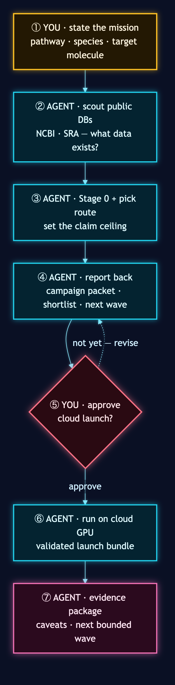
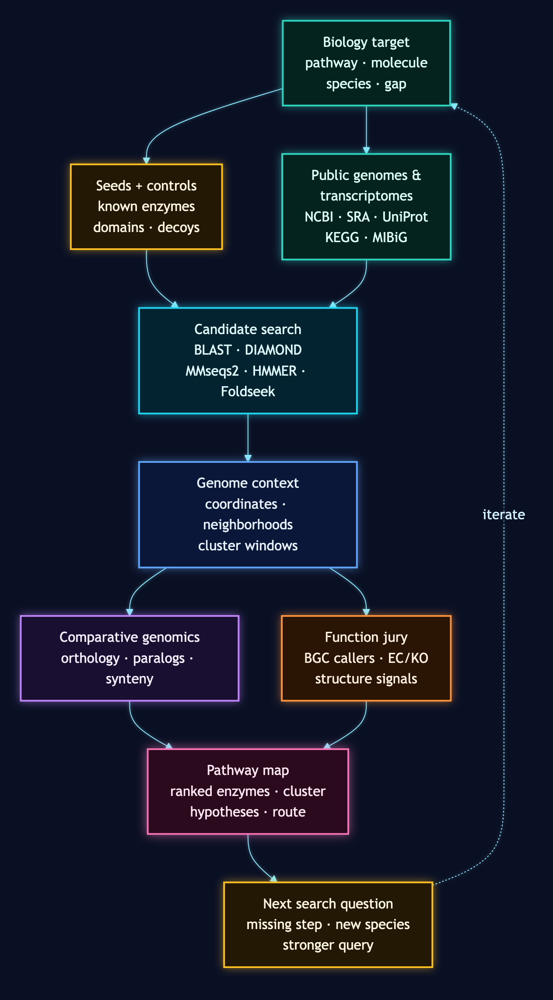
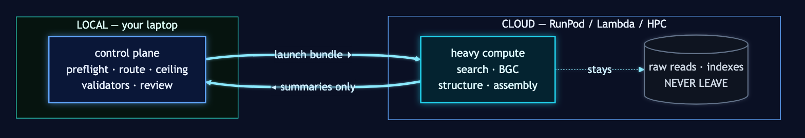

# BioSymphony GeneCluster

[](https://github.com/BioSymphony/genecluster/actions/workflows/public-release-check.yml)
[](LICENSE)
[](CITATION.cff)
[](docs/agent-orchestrator-guide.md)


**A skill repo for agents running long-horizon genome-mining campaigns.**

BioSymphony GeneCluster helps Claude Code, Codex, Symphony, and other agent harnesses work through long comparative-genomics tasks without losing track of inputs, controls, routes, tool runs, and review packets. You give the agent a pathway, target molecule, or biosynthetic gap. The repo gives the agent reusable skill instructions, ledgers, runners, checks, and examples for turning that question into a genome-mining campaign.

A request like *"find the benzylisoquinoline alkaloid gene cluster in Berberis vulgaris using Coptis chinensis as the canonical reference,"* *"assemble pathway support for a target molecule starting from Coptis chinensis and three Coptis relatives,"* or *"fill the missing step in this terpene pathway using Solanaceae candidates"* becomes a staged agent workflow. The same packet shape works for a solo agent on a laptop or for a multi-issue tracker graph with cloud workers.

The skill supplies source scouts, query and control ledgers, route cards, candidate-search contracts, genome-context capture, BGC callers, function-scoring tools, and reviewable pathway outputs.

## How A Session Looks

You open this repo in Claude Code, Codex, or Symphony. You tell your agent:

> I want to characterize the benzylisoquinoline alkaloid gene cluster across the Ranunculales. Start with *Coptis chinensis* as the canonical producer, then find related clusters in *Berberis vulgaris* and two more Berberidaceae. Tell me which enzymes are conserved, which look species-specific, and where the cluster boundaries land. Stay local for the control plane. We will discuss a RunPod launch once the route is set.

The agent reads `skills/biosymphony/SKILL.md`, checks NCBI Datasets and SRA for assembly and RNA-Seq state, drafts the campaign packet, chooses a route for the available data, records what that route can support, and reports back with candidate genes, nearby genomic context, tool outputs, and the next bounded wave. You review and approve any cloud launch when ready.

You set the biological question and review the packet. The repo gives the agent the repeatable operating path.

<p align="center"></p>

## Campaigns You Can Run

- **Find a biosynthetic gene cluster in a new species.** Pick a known pathway (BIA, MIA, terpene, polyketide, custom) and a target species. The agent scouts public genomes and transcriptomes, runs candidate-gene search by homology and structure, anchors hits in genomic context, detects clusters with plantiSMASH, antiSMASH, and DeepBGC, and scores enzyme function across several tools.
- **Fill gaps in a published pathway.** Point the agent at a known partial pathway plus the step that needs catalyzing. The agent searches related species, ranks candidates, and proposes the strongest follow-up targets.
- **Assemble pathway support toward a target molecule.** Pick a target compound, such as a terpene or plant secondary metabolite. The agent assembles candidate enzymes from canonical and comparator species and produces a pathway map for review.
- **Compare a pathway across a plant family.** Let Symphony workers, Claude Code workers, or your preferred agent take bounded waves in parallel: source scout, candidate search, BGC calling, synteny, function scoring, and review surface.
- **Hunt for novel analogs and uncharacterized clusters.** Combine BGC callers (plantiSMASH, antiSMASH, DeepBGC) with structural homology (Foldseek + ProstT5) and function prediction (HMMER, InterProScan, DeepEC) to find candidate clusters your canonical query missed.
- **Long-horizon comparative-genomics programs.** Each completed campaign can add species rows, novelty windows, and cluster-confidence notes back into `data/pathway-species-catalog.tsv`, so later campaigns start with better context.
- **Next-experiment design.** Convert open questions into assay, sequencing, or metabolomics recommendations before spending wet-lab time or sequencing budget.
- **Extend the kit with new tooling.** The recommended-tool skill ships ready-to-invoke shortcuts for 25 checked tools, including Quarto, plantiSMASH 2.0.4, antiSMASH 8.0.4, DeepBGC, JCVI MCScan, MMseqs2, Foldseek + ProstT5, HMMER, InterProScan, ESM-C / ESM-2, ColabFold, KEGG/KAAS, EnzymeMap, DiffPaSS, DeepEC, igv-reports, pyGenomeTracks, and Cytoscape.js.

<p align="center"></p>

## Use It With Your Agent Stack

GeneCluster is harness-agnostic. Wire it into whichever multi-agent setup fits your work:

- **Symphony + Linear.** Full multi-agent campaign with the issue-contract DAG, dependencies, review gates, and Symphony-style workers.
- **Claude Code workers + Linear** (or GitHub Issues, or any tracker). Same contracts, your tracker stores the issue graph, Claude workers fan out the waves.
- **Codex, Claude Code, or any agent + `/goal`.** A solo capable agent drives the whole campaign through the same artifact contracts. Launch from [templates/goal-prompt.md](templates/goal-prompt.md).
- **Your custom orchestrator.** Point your agent at [docs/agent-orchestrator-guide.md](docs/agent-orchestrator-guide.md). The repo works with whichever orchestrator you drive it from.

## Local And Cloud Lanes

<p align="center"></p>

- **Local laptop.** The control plane runs on Python 3, `make`, and ripgrep. It covers preflight, source and route scouting, contracts, checks, compact summaries, and review surfaces. The demo harness produces the full campaign packet offline.
- **RunPod, AWS, GCP, Vast.ai, Lambda Labs.** Provider-neutral launch bundles and dispatch templates handle heavy candidate search, BLAST/MMseqs2/Foldseek workloads, plantiSMASH and antiSMASH BGC calling, structural model inference, and large transcriptome work. Provider state stays out of the source tree.
- **SSH / HPC.** The same launch contracts work on your cluster.

Agents escalate to cloud after local checks pass for the launch bundle and stage contract.

## Routes And Review Limits

GeneCluster records what the available data can support. Stage 0 classifies the target genome and transcriptome state, that choice selects a route, and each route carries a review limit. A transcript-first run can nominate candidate genes, while physical cluster boundaries require genome coordinates.

<p align="center"></p>

## What's In The Repo

- `skills/biosymphony/`: campaign contracts, checks, scouts, normalizers, and remote runners.
- `skills/genecluster-superpowers/`: recommended-tool integration kit with per-tool quickstarts and runner scripts.
- `pipeline/`: pipeline scaffolds, enrichment helpers, dockerstart builders.
- `images/`: Docker build contexts and cloud-dispatch templates for RunPod, AWS, GCP, Vast.ai, Lambda Labs.
- `docs/`: capability maps, campaign runbooks, tool inventories, cloud-runtime notes, atlas authoring guidance, architecture and workflow diagrams.
- `data/`: public pathway and species catalog seeded with Ranunculales BIA and MIA pathway producers, with NCBI accessions and PMID provenance.
- `templates/`: tracker-neutral issue contract plus a `/goal`-style prompt for solo agents.
- `tools/`: recommended-tool install scripts (cheap, medium, heavy tiers) and the demo harness.

## Start Here

- [docs/capability-stack.md](docs/capability-stack.md): the full capability surface.
- [docs/glossary.md](docs/glossary.md): terms-of-art used across the skill, including route cards, support normalizers, maturity ladders, and review limits.
- [docs/agent-orchestrator-guide.md](docs/agent-orchestrator-guide.md): drive the repo with Codex, Claude Code, Symphony + Linear, `/goal`, or your own orchestrator.
- [docs/genecluster-atlas-superpower-runbook.md](docs/genecluster-atlas-superpower-runbook.md): atlas campaign operating path from source scout to review surface.
- [docs/biosymphony-tooling-status.md](docs/biosymphony-tooling-status.md): the 25 checked tools, parked re-entry recipes, gated tools.
- [skills/genecluster-superpowers/SKILL.md](skills/genecluster-superpowers/SKILL.md): shortcut kit for adding checked tools to the atlas workflow.
- [docs/architecture.md](docs/architecture.md): the control-plane model.
- [docs/diagrams/biosymphony-genecluster-architecture.png](docs/diagrams/biosymphony-genecluster-architecture.png): execution-scale architecture diagram.
- [docs/diagrams/biosymphony-genecluster-workflow.png](docs/diagrams/biosymphony-genecluster-workflow.png): discovery-engine workflow diagram.

## Verify The Skill Works

You do not need to run anything by hand to use the skill. These commands exist for maintainers, curious onlookers confirming the snapshot is healthy, and as concrete examples of what your agent will invoke during a campaign.

Requirements: Python 3, `make`, ripgrep (`rg`). No paid provider access required.

```bash
make public-release-check
```

Checks the full skill, runs the GeneCluster example preflight, generates the campaign issue drafts, produces the summary manifest, renders a review surface, and runs the unit tests.

```bash
make demo-campaign-dry-run
```

Same campaign, lighter output. Use `make demo-campaign-smoke` for the smallest issue graph, or `make demo-campaign-public-mining` for the full public-mining contract graph. Each writes a generated `README.md` and `demo-summary.json` into its output directory.

A focused GeneCluster contract example against the bundled Coptis BIA campaign (this is the kind of command your agent will assemble during a real campaign):

```bash
python3 skills/biosymphony/scripts/genecluster_preflight.py \
  --campaign skills/biosymphony/examples/genecluster-coptis-bia-public-v0/campaign-manifest.json \
  --project-goals skills/biosymphony/examples/genecluster-coptis-bia-public-v0/project-goals.yaml \
  --pathway-steps skills/biosymphony/examples/genecluster-coptis-bia-public-v0/pathway-steps.tsv \
  --data-ledger skills/biosymphony/examples/genecluster-coptis-bia-public-v0/data-ledger.tsv \
  --query-ledger skills/biosymphony/examples/genecluster-coptis-bia-public-v0/query-ledger.tsv \
  --resource-ledger skills/biosymphony/examples/genecluster-coptis-bia-public-v0/resource-ledger.tsv \
  --database-ledger skills/biosymphony/examples/genecluster-coptis-bia-public-v0/database-ledger.tsv \
  --cache-ledger skills/biosymphony/examples/genecluster-coptis-bia-public-v0/cache-ledger.tsv
```

For a new agent-orchestrated campaign, hand your agent [templates/goal-prompt.md](templates/goal-prompt.md).

## Documentation

See [docs/README.md](docs/README.md) for the full documentation index, [CLAUDE.md](CLAUDE.md) and [AGENTS.md](AGENTS.md) for agent operating rules, [CONTRIBUTING.md](CONTRIBUTING.md) for how to contribute, [SECURITY.md](SECURITY.md) for security reporting, and [PUBLIC_RELEASE.md](PUBLIC_RELEASE.md) for the maintainer release checklist.
