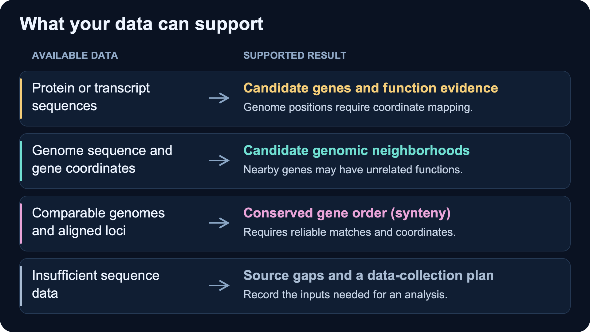
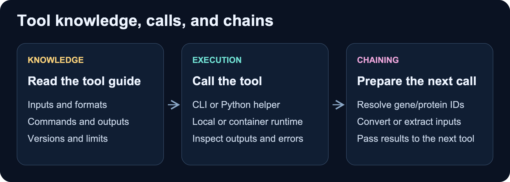
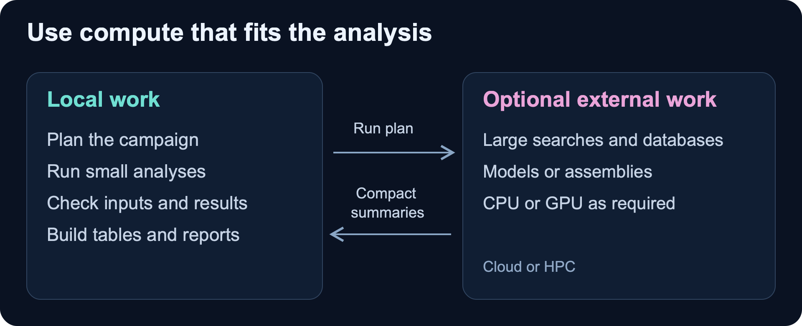

# BioSymphony GeneCluster

[](https://github.com/BioSymphony/genecluster/actions/workflows/public-release-check.yml)
[](LICENSE)
[](CITATION.cff)
[](docs/agent-orchestrator-guide.md)

BioSymphony GeneCluster is a toolkit for AI agents to find and compare candidate biosynthetic genes and gene clusters across genomes.

Give your agent a pathway, species, and any known data sources. The toolkit supplies instructions, scripts, and templates for searches and comparisons. Results include candidate-gene tables, genomic neighborhoods, and comparative reports with sources and stated limits.


## Start Here

Open this repository in your agent and ask it to read the [campaign skill](skills/biosymphony/SKILL.md). Then use the [goal prompt](templates/goal-prompt.md) to specify your question, inputs, and compute limits.

Replace the bracketed fields:

> Compare [pathway] across [species] using public data. Return candidate-gene tables, conserved genomic neighborhoods, and unresolved questions. Cite the sources for each finding. Prepare a compute plan before any external run.

To inspect the bundled example, run:

```bash
make demo-campaign-dry-run
```

The demo uses public or synthetic fixtures without external compute and prints its output directory. See the [demo guide](docs/demo-campaign-dry-run.md) for requirements and outputs.

## What the Kit Does

Each campaign investigates one question. Available evidence determines its outputs:

| Output | What you can inspect |
|---|---|
| Candidate-gene tables | Search hits, source identifiers, and supporting sequence, domain, structure, or expression evidence |
| Genome-context comparisons | Gene coordinates, nearby genes, and conserved gene order across species |
| Comparative reports | Findings, conflicting evidence, missing data, and follow-up questions |
| Run records | Input sources, tool and database versions, parameters, checksums, and validation results |

Genome coordinates are required to assess physical cluster boundaries. Transcript evidence can identify candidate genes; it cannot establish their positions in a genome.

<p align="center"></p>

## How a Campaign Works

The agent:

1. records the question, species, inputs, and controls;
2. checks available data and selects a supported analysis route;
3. runs bounded searches locally or prepares an external launch plan;
4. combines results into evidence tables and checks their identifiers and provenance;
5. returns findings, limitations, and the next proposed action.

<p align="center"></p>

## Execution Options

Use local compute for planning, small file transformations, validation, and reports. Large searches, models, assemblies, and database operations can run on approved cloud or HPC infrastructure.

Coordinate with one agent or independent workers. A tracker such as Linear is optional; campaign files record the evidence and results.

Keep raw data, large outputs, credentials, provider responses, and unpublished sequences outside this repository.

<p align="center"></p>

## Repository Layout

| Directory | Contents |
|---|---|
| `skills/biosymphony/` | Campaign instructions, input records, checks, and runners |
| `skills/genecluster-superpowers/` | Tool quickstarts and wrappers |
| `pipeline/` and `images/` | Pipeline scaffolds, container definitions, and dispatch references |
| `docs/` | Workflow, tool, and review guidance |
| `data/` and `templates/` | Public examples, work-unit templates, and campaign prompts |
| `tools/` | Optional installers, wrappers, and repository checks |

See the [documentation index](docs/README.md) for campaign guides, the [tooling status](docs/biosymphony-tooling-status.md) for checked integrations, and the [tooling radar](docs/biosymphony-next-tooling-radar.md) for proposed additions.

## Verify the Public Snapshot

Maintainers need Python 3 with `openpyxl`, `make`, and ripgrep (`rg`). Run:

```bash
make public-release-check
```

For the publication audit without demo execution, use `make public-audit-strict`. Both commands remove generated caches. See [public release safety](docs/public-release-safety.md) for the checks and their limits.

## Contribute

Read [CONTRIBUTING.md](CONTRIBUTING.md) before opening a change. Report security problems through [SECURITY.md](SECURITY.md).
