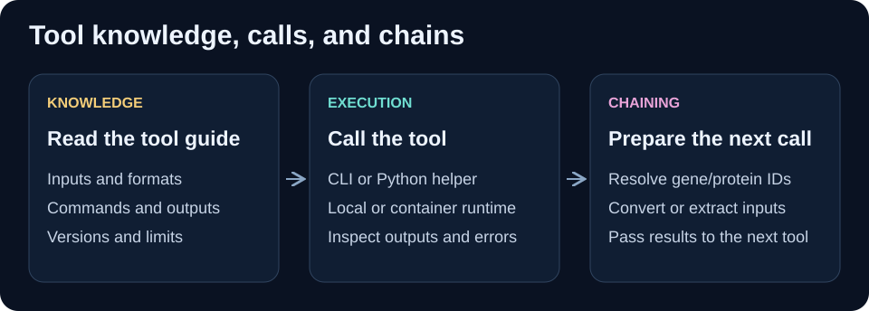
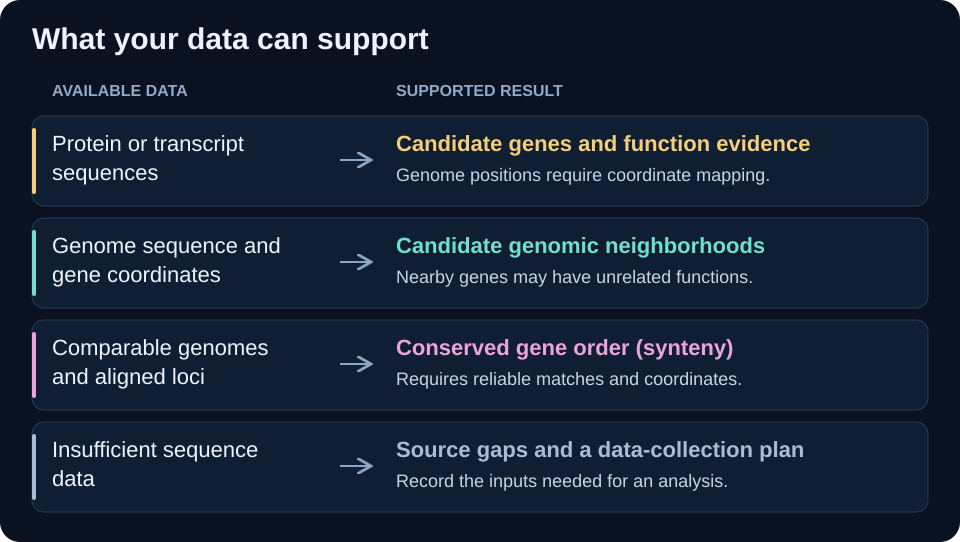
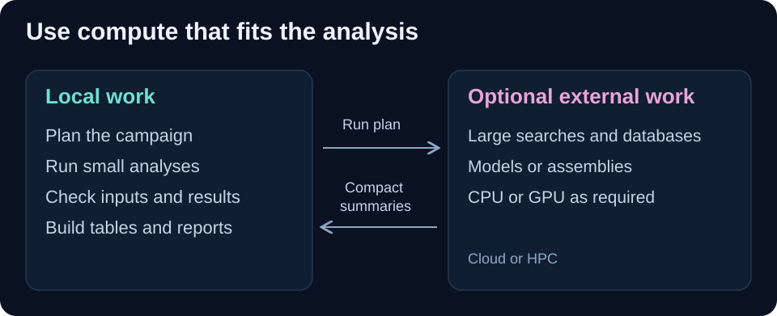

# BioSymphony GeneCluster

[](https://github.com/BioSymphony/genecluster/actions/workflows/public-release-check.yml)
[](LICENSE)
[](CITATION.cff)
[](docs/agent-orchestrator-guide.md)

BioSymphony GeneCluster is a toolkit for AI agents to find and compare candidate biosynthetic genes and gene clusters using genome and transcriptome data.

Give your agent a pathway, species, and any known data sources. The toolkit supplies instructions, scripts, and templates for searches and comparisons. Results include candidate-gene tables, genomic neighborhoods where coordinates are available, and comparative reports with sources and stated limits.


## Start Here

Open this repository in your agent and ask it to read the [campaign skill](skills/biosymphony/SKILL.md). Then use the [goal prompt](templates/goal-prompt.md) to specify your question, inputs, and compute limits.

Replace the bracketed fields:

> Compare [pathway] across [species] using public data. Return candidate-gene tables and unresolved questions. Compare genomic neighborhoods where coordinates are available. Cite the sources for each finding. Prepare a compute plan before any external run.

To inspect the bundled example, run:

```bash
make demo-campaign-dry-run
```

The demo uses public or synthetic fixtures without external compute and prints its output directory. See the [demo guide](docs/demo-campaign-dry-run.md) for requirements and outputs.

## What’s Included

| Component | Use it to |
|---|---|
| [Campaign skill](skills/biosymphony/SKILL.md) | Plan searches, record inputs, select analyses, and check results |
| [Tool skill](skills/genecluster-superpowers/SKILL.md) | Find quickstarts and wrappers for search, annotation, cluster comparison, and reporting |
| [Templates](templates/goal-prompt.md) and [demo fixtures](docs/demo-campaign-dry-run.md) | Define a campaign and inspect a small example before running your own data |

Choose tools for the organism and task. For example, antiSMASH covers bacterial and fungal clusters; plantiSMASH covers plant clusters. The [tooling status](docs/biosymphony-tooling-status.md) distinguishes checked integrations, setup requirements, and proposed additions.

## How a Campaign Works

<a href="docs/diagrams/genecluster-session-flow.svg">
  <picture>
    <source media="(max-width: 600px)" srcset="docs/diagrams/genecluster-session-flow-mobile.svg">
    
  </picture>
</a>

The agent checks data availability before selecting analyses. You approve the scope and resource limits for external work. Use one agent or independent workers; a tracker such as Linear is optional.

## Results You Can Inspect

Each campaign investigates one question. Available evidence determines its outputs:

| Output | What you can inspect |
|---|---|
| Candidate-gene tables | Search hits, source identifiers, and supporting sequence, domain, structure, or expression evidence |
| Genome-context comparisons | Gene coordinates, nearby genes, and conserved gene order across species |
| Comparative reports | Findings, conflicting evidence, missing data, and follow-up questions |
| Run records | Input sources, tool and database versions, parameters, checksums, and validation results |

### What the Data Supports

<a href="docs/diagrams/genecluster-route-claim-ceiling.svg">
  <picture>
    <source media="(max-width: 600px)" srcset="docs/diagrams/genecluster-route-claim-ceiling-mobile.svg">
    
  </picture>
</a>

Physical neighborhood claims require genome coordinates, including explicit transcript-to-genome mapping where needed. Sequence similarity, predicted function, and conserved gene order provide evidence for a candidate; they do not establish biochemical activity. See the [analysis routes](docs/glossary.md#routes-and-claim-ceilings) for requirements and limits.

## Execution Options

<a href="docs/diagrams/genecluster-local-cloud-boundary.svg">
  <picture>
    <source media="(max-width: 600px)" srcset="docs/diagrams/genecluster-local-cloud-boundary-mobile.svg">
    
  </picture>
</a>

Choose CPU or GPU resources for the selected tools and dataset size. Keep raw data, large outputs, credentials, provider responses, and unpublished sequences outside this repository.

## Guides and Tool Reference

Use the [documentation index](docs/README.md) for campaign guides and the [tooling radar](docs/biosymphony-next-tooling-radar.md) for proposed additions. See the [container contract](images/genecluster-superpowers/CONTRACT.md) for packaged runtimes and [optional installers](tools/recommended/README.md) for local setup.

## Verify the Public Snapshot

Maintainers need Python 3 with `openpyxl`, `make`, and ripgrep (`rg`). Run:

```bash
make public-release-check
```

For the publication audit without demo execution, use `make public-audit-strict`. Both commands remove generated caches. See [public release safety](docs/public-release-safety.md) for the checks and their limits.

## Contribute

Read [CONTRIBUTING.md](CONTRIBUTING.md) before opening a change. Report security problems through [SECURITY.md](SECURITY.md).
