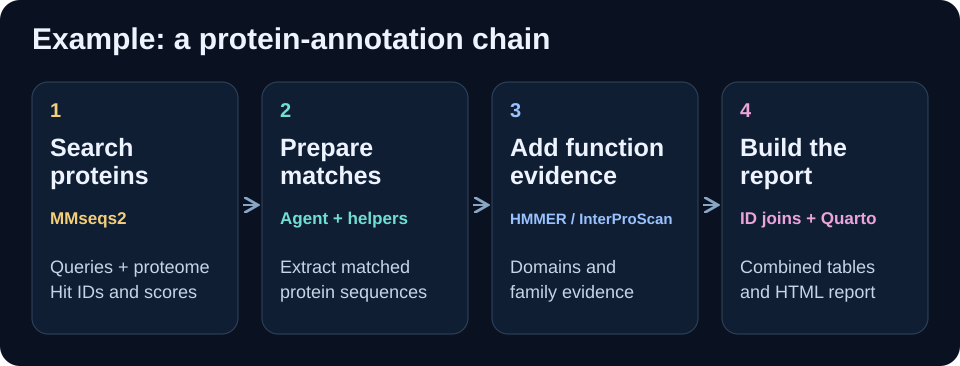

# BioSymphony GeneCluster

[](https://github.com/BioSymphony/genecluster/actions/workflows/public-release-check.yml)
[](LICENSE)
[](CITATION.cff)
[](skills/genecluster-superpowers/SKILL.md)

BioSymphony GeneCluster gives AI agents a bioinformatics tool knowledge base, tool-calling helpers, and examples for chaining analyses across genome and transcriptome data.

Ask your agent to find candidate genes, compare gene clusters, or investigate protein function. It uses the guides to select tools, prepare inputs, run commands, and connect results into the next analysis or report.


## Start With Your Agent

Open this repository in your agent and ask it to read [GeneCluster Superpowers](skills/genecluster-superpowers/SKILL.md). For example:

> Find candidate genes for [pathway] across [organisms]. Use the tool knowledge base to choose sequence-search, annotation, and comparison tools. Check what is installed, explain the tool chain, and run the approved analyses. Connect results by gene or protein ID. Return candidate tables and comparative plots, with sources and unresolved questions.

To inspect local tool availability:

```bash
bash skills/genecluster-superpowers/scripts/superpowers-status.sh
```

Then open the [tool-calling guide](docs/tooling/tool-chaining.md) for entry points, required inputs, and wrapper readiness.

## Tool Knowledge, Calls, and Chains

<a href="docs/diagrams/genecluster-session-flow.svg">
  <picture>
    <source media="(max-width: 600px)" srcset="docs/diagrams/genecluster-session-flow-mobile.svg">
    
  </picture>
</a>

The [knowledge base](docs/tooling/README.md) describes tool inputs, commands, outputs, and limits. The [version table](docs/biosymphony-tooling-status.md) separates checked baselines from newer releases. The [tool radar](docs/biosymphony-next-tooling-radar.md) tracks proposed additions, including AI models and source-lookup tools.

Agents call installed command-line tools, Python helpers, or prepared containers. Between calls, they resolve identifiers, extract sequences, convert formats, and check results. The [calling guide](docs/tooling/tool-chaining.md) distinguishes runnable wrappers from templates that need adaptation.

## Tools You Can Combine

| Task | Tools and references | Useful output |
|---|---|---|
| Find related proteins | [MMseqs2](docs/tooling/mmseqs2.md), BLAST, DIAMOND | Match IDs, alignments, and scores |
| Compare structures | [Foldseek + ProstT5](docs/tooling/foldseek-prostt5.md) | Structure-similarity evidence |
| Add function evidence | HMMER/Pfam, InterProScan, curated UniProt records | Domains and candidate annotations |
| Find and compare clusters | [antiSMASH](docs/biosymphony-antismash-cookbook.md), [plantiSMASH](docs/tooling/plantismash.md), [cblaster + clinker](docs/tooling/cblaster-clinker.md) | Candidate regions and interactive gene maps |
| Compare gene order | [JCVI MCScan](docs/tooling/jcvi-mcscan.md) | Synteny anchors and plots |
| Build reports and views | [Quarto](docs/tooling/quarto.md), [Cytoscape.js](docs/tooling/cytoscape-js.md) | HTML reports and interactive networks |

Choose tools for the organism and task: antiSMASH covers bacterial and fungal clusters; plantiSMASH covers plant clusters. See [tooling status](docs/biosymphony-tooling-status.md) for each integration’s requirements.

## How Tools Connect

<a href="docs/diagrams/genecluster-tool-chain.svg">
  <picture>
    <source media="(max-width: 600px)" srcset="docs/diagrams/genecluster-tool-chain-mobile.svg">
    
  </picture>
</a>

This example requires the agent to extract matched sequences and adapt output columns between tools. HMMER and InterProScan add domain and family evidence. Prepare the report project with the joined tables and plots.

| Another chain | Required handoff | Result |
|---|---|---|
| cblaster → cluster extraction → clinker | Preserve the search session and export annotated GenBank regions | Interactive cluster comparison |
| Genome annotation → JCVI → report | Match gene IDs between coordinates and sequence files; retain synteny anchors | Cross-genome gene-order plots |
| Tool results → table helpers → report | Convert supported output columns and join by stable identifiers | Candidate tables with combined evidence |

The [calling and chaining guide](docs/tooling/tool-chaining.md) explains these handoffs. Protein and transcript data support candidate searches. Neighborhoods require genome coordinates; synteny requires comparable coordinates across genomes. Predicted function remains candidate evidence.

## Run and Explore

Use local CPU or GPU resources when suitable; larger workloads can use approved cloud or HPC compute. Keep raw data, model caches, large outputs, and credentials outside the source tree.

The [demo](docs/demo-campaign-dry-run.md) exercises small fixtures and output checks without external compute:

```bash
make demo-campaign-dry-run
```

Use the [campaign helpers](skills/biosymphony/SKILL.md) for input tracking and longer analyses. A tracker is optional.

<details>
<summary>Maintainer Checks and Further Reading</summary>

Run `make public-release-check` with Python 3, `openpyxl`, `make`, and ripgrep installed. See [public release safety](docs/public-release-safety.md), [the documentation index](docs/README.md), [CONTRIBUTING.md](CONTRIBUTING.md), and [SECURITY.md](SECURITY.md).

</details>
