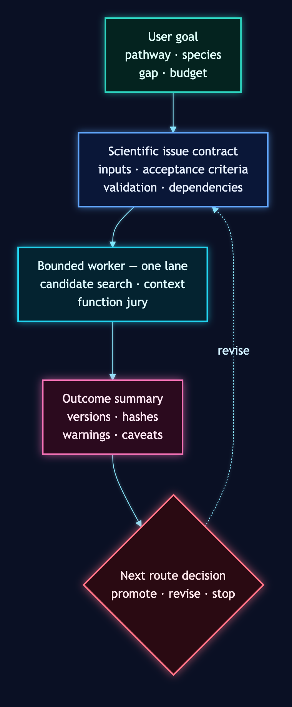

# Agent Orchestrator Guide

BioSymphony GeneCluster is designed for a capable coding/research agent such as
Codex or Claude Code. The repo supplies the campaign contracts, validators,
route vocabulary, example ledgers, issue templates, and provider handoff shapes.
The agent supplies judgment: reading the user's goal, choosing the right first
wave, filling in ordinary glue, and deciding when a Symphony + Linear style task
graph is worth creating.

## What The Repo Should Do

- Give the agent a proven starting path for a pathway/species campaign.
- Turn vague scientific intent into source ledgers, route cards, bounded worker
  issues, validation commands, dossiers, and review surfaces.
- Keep biological claims tied to explicit evidence levels.
- Preserve enough provider-neutral structure that a local workstation, RunPod,
  SSH/HPC, or cloud VM can all be execution lanes.
- Make a long campaign resumable by storing contracts and outcomes in Linear,
  GitHub Issues, another tracker, or a `/goal` style task manager.

## What The Agent Should Do

- Translate the user's goal into a campaign packet, not wait for every field to
  be pre-filled.
- Decide whether to stay local, create a small issue graph, or fan out through
  Symphony-style workers.
- Use existing validators before dispatch and after artifact pullback.
- Replace missing one-off glue with small scripts or issue text when that is
  faster than adding framework.
- Escalate to cloud only when the local proof path has established the route,
  expected artifacts, and claim ceiling.

The repo should not try to automate every judgment a strong agent can make. If a
gap is just "decide the next bounded worker" or "write a straightforward
adapter around a known ledger," that is normal orchestrator work, not a missing
platform feature.

## Default Flow For A New Goal

1. Read the user's requested target pathway, species, available inputs, desired
   output, budget/time boundary, and preferred execution lane.
2. Run `make demo-campaign-dry-run` once if the environment is new. This proves
   the local control plane before touching real data or cloud resources.
3. Create or adapt a campaign packet with `campaign-manifest.json`,
   `project-goals.yaml`, pathway/query/data ledgers, and fixture or real input
   references.
4. Run campaign preflight and source scouting. If source/query evidence is weak,
   keep the campaign at planning or next-experiment design.
5. Run route scouting and record the claim ceiling before any search worker is
   launched.
6. Choose the execution pattern:
   - Solo agent: small local/scout/dossier pass.
   - Symphony + Linear: multi-wave campaign with dependencies and review gates.
   - `/goal` or another task manager: use the same artifacts as milestones.
   - Cloud/provider: only after a launch bundle and stage contract validate.
7. Pull back compact summaries, ledgers, reports, versions, hashes, and review
   HTML. Keep raw/heavy data in the approved execution or storage lane.
8. Close with validation commands, artifact paths, claim caveats, and the next
   route decision.

## Scale Decision

| Situation | Best default |
|---|---|
| User wants to know where to start | Solo agent, demo harness, source/route scout, one campaign packet |
| Inputs are incomplete or ambiguous | Stage 0 preflight plus input audit, then ask only blocking questions |
| One species and public annotations are available | Local or light provider annotation-direct issue |
| Multi-species atlas, many evidence lanes, or reviewer-grade claims | Symphony + Linear issue DAG |
| Heavy BLAST/MMseqs/Foldseek/assembly work | Provider-neutral launch bundle, then RunPod/HPC/cloud lane |
| Evidence gap is biological, not computational | `next_experiment_design` route with assay/sequencing recommendations |

## Agent Closeout Shape

For any substantial campaign pass, finish with:

- What route was selected and why.
- Which claim level is currently allowed.
- Which validators ran.
- Where the compact artifacts live.
- Which issue/wave should run next, if any.
- What remains a biological uncertainty rather than an orchestration gap.
