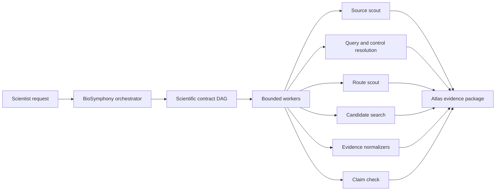

# Architecture

## Core Thesis

Comparative-genomics atlas work is not one command. It is a claim graph:

1. Define the pathway, target species, comparator set, and claim ceiling.
2. Scout public source availability and resolve seed queries with controls.
3. Select the least-overclaiming route: annotation-direct, transcript-first, genome-context, synteny, or next-experiment design.
4. Run bounded search and annotation lanes with explicit validation artifacts.
5. Normalize evidence into ledgers, model-jury tables, and comparative atlas views.
6. Review claims, caveats, versions, and provenance before publishing an evidence package.

The orchestration layer is useful because each stage has clear inputs, outputs, validation commands, dependencies, and review gates.

## System Diagram



## Why The Tracker Is The Scientific Ledger

Each issue should preserve:

- scientific goal
- exact inputs
- expected artifacts
- acceptance criteria
- validation commands
- touched areas
- dependencies
- final `symphony-outcome` comment



This makes the campaign reviewable after the fact. A researcher can ask why a candidate exists, which public source supported it, which query/control produced it, which route was rejected, and which validation accepted or caveated the claim.

## Why Workers Are The Lab Crew

BioSymphony turns a large research objective into isolated, bounded workers:

- source worker produces source/query ledgers
- route worker records the allowed claim level and rejected routes
- annotation worker runs candidate search and controls
- comparative worker scores conservation, synteny, and lineage context
- report worker builds summary-only review surfaces
- QA worker checks provenance, caveats, licenses, hashes, and absence of raw/heavy data

The orchestrator reviews each wave, integrates useful output, records learnings, and only then unlocks the next wave.

## Artifact Contract

Every serious campaign should produce a bundle like:

```text
genecluster-evidence-package/
  campaign-manifest.json
  source-ledger.tsv
  query-resolution-ledger.tsv
  route-decision.json
  cluster-calls.tsv
  protein-function-jury.tsv
  comparative-atlas/
  review/
  claim-ledger.tsv
  provenance.md
```



## High-Value Differentiator

GeneCluster turns "find this gene cluster" or "assemble this pathway" into a reproducible discovery workflow with route cards, ledgers, review gates, and provider handoffs. The same workflow scales from a solo agent on a laptop to a multi-agent Linear DAG fanning out across cloud GPUs.
