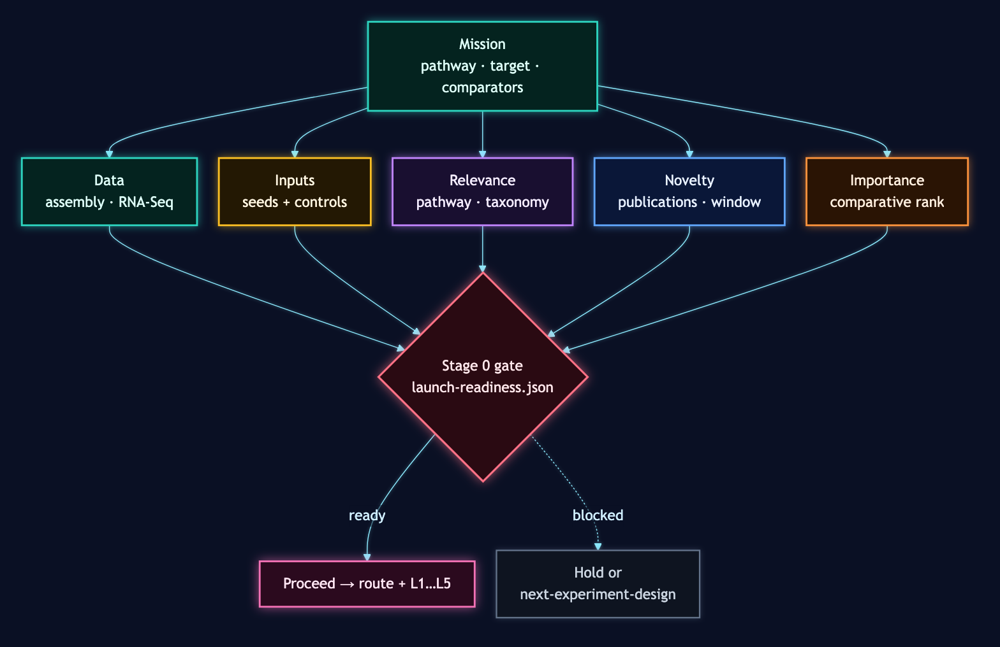
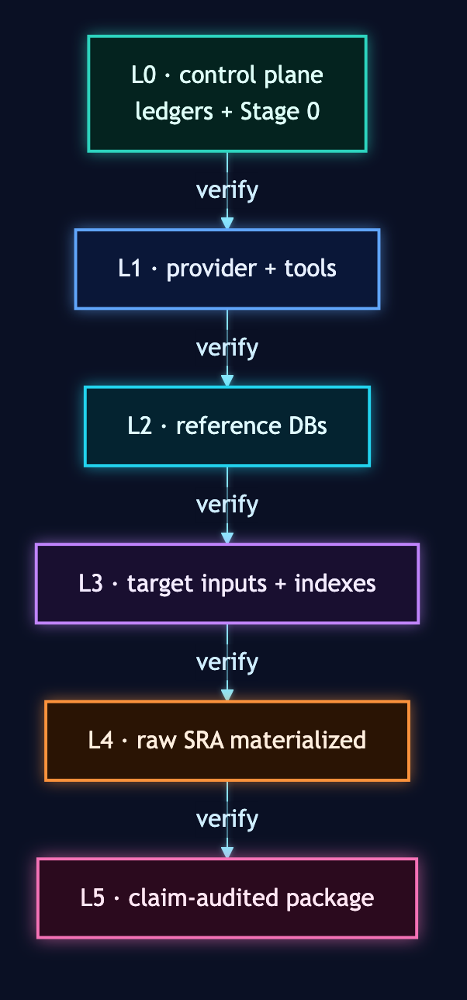
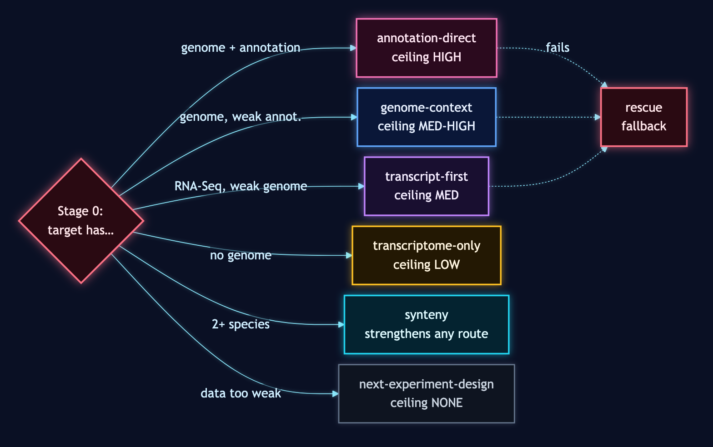
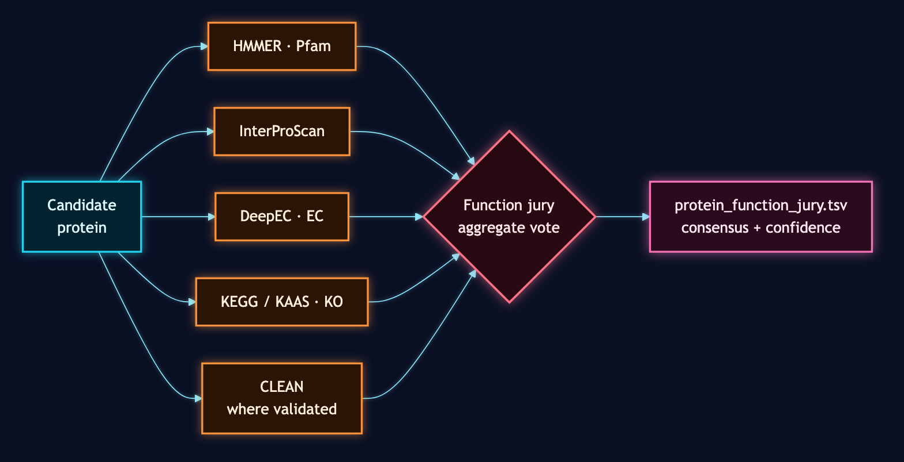

# Glossary

Terms-of-art used across the BioSymphony GeneCluster skill. Read this before reading any of the campaign runbooks or the SKILL.md files.

## Mission, Campaign, Wave

- **Mission.** The user's request in plain language. *"Find the BIA gene cluster in Berberis vulgaris using Coptis chinensis as the canonical reference,"* *"Assemble pathway evidence for a target molecule starting from Coptis chinensis and three Coptis relatives,"* or *"Fill the missing step in this terpene pathway using Solanaceae candidates."*
- **Campaign.** The structured, contract-backed plan derived from a mission. A campaign has a manifest, ledgers, a route, a claim ceiling, and a target maturity level.
- **Wave.** A bounded batch of work inside a campaign. Waves group issues such as source scout, candidate search, BGC calling, synteny, function jury, and review surface; each wave runs in parallel and ends at a review gate.

## Campaign Inputs

- **Campaign manifest** (`campaign-manifest.json`). The top-level contract for a campaign. Names the target species, pathway, comparators, run scope, and expected artifacts.
- **Source ledger** (`source-ledger.tsv`). Records every public source the campaign will draw from: genome assemblies, RNA-Seq projects, annotation files, with provider, accession, record type, and acquisition policy.
- **Query ledger** (`query-ledger.tsv`). The seed protein query set: anchor proteins from canonical species, positive and negative controls, identifiers resolved to UniProt or equivalent.
- **Pathway-steps ledger** (`pathway-steps.tsv`). The biochemical steps the campaign cares about, in order, with EC numbers and known catalyzing enzyme families.
- **Resource ledger** (`resource-ledger.tsv`). Tools, databases, and compute slots the campaign expects to use.
- **Database ledger** (`database-ledger.tsv`). Reference databases (Pfam, SwissProt, KEGG, MIBiG, P450Rdb, and so on) with version pins.
- **Cache ledger** (`cache-ledger.tsv`). What can be reused from previous campaigns.

## Stage 0 And The Maturity Ladder

- **Stage 0 preflight.** Mandatory data-and-readiness check before any compute spend. Answers five questions: data availability, input completeness, pathway relevance, novelty window, and importance ranking. Output: `campaign-launch-readiness.json` with `preflight_status: "ready"` or a blocker.
- **Maturity ladder.** Stages a campaign progresses through. No stage may declare success before the prior stage is verified.
  - `L0_control_plane_ready`: manifests, ledgers, and a passing Stage 0 preflight exist.
  - `L1_provider_tool_ready`: provider image and toolchain pass health checks.
  - `L2_provider_db_ready`: reference databases are staged on the provider.
  - `L3_target_materialized_ready`: target species inputs (FASTA, protein, transcript, genome) and indexes are present.
  - `L4_raw_sra_pipeline_ready`: raw SRA reads are fetched, converted, and materialized into searchable target sequences.
  - `L5_claim_audited_dossier_ready`: legacy maturity id for a validated evidence package; candidate hits, anchors, neighborhoods, provenance, versions, and claim checks all validate.

## Routes And Claim Ceilings

- **Route.** The defensible evidence path the campaign is allowed to follow. Routes have explicit claim ceilings; choosing a weaker route is fine, choosing one your data cannot support is the failure mode this vocabulary is designed to prevent.
  - `annotation-direct`: target species has chromosome-level genome with annotation. Strongest claim ceiling.
  - `transcript-first`: target has RNA-Seq but weak genome annotation. Discover candidates in transcripts/ORFs first; treat direct genome `tblastn` as rescue evidence.
  - `genome-context`: target has genome but limited annotation. Use coordinate anchoring and neighborhood capture.
  - `synteny`: comparative-genomics evidence across multiple species with anchoring.
  - `transcriptome-only`: no genome at target; assembly from reads. Lower claim ceiling.
  - `rescue`: a fallback when the primary route fails partway through.
  - `next-experiment-design`: data is too weak; convert the campaign into assay or sequencing recommendations instead of compute.
- **Route card.** The artifact that records the chosen route, the rejected routes, the rationale, and the claim ceiling. Produced by `genecluster_annotation_scout.py` and read by every downstream worker.
- **Claim ceiling.** The strongest scientific claim the chosen route is allowed to support. A campaign that detects a cluster on `transcript-first` evidence cannot claim physical genomic cluster boundaries; the claim ceiling forbids that.

## Evidence And Review

- **Candidate hit.** A protein or gene that scored well on the campaign's search lanes. Rows live in `candidate_hits.tsv`.
- **Evidence normalizer.** A script that turns raw tool output (BLAST tables, BGC caller results, function-prediction votes) into the campaign's canonical TSV shape so downstream lanes do not need tool-specific parsers. See `genecluster_atlas_normalizers.py`.
- **Function jury.** The aggregated vote across multiple function-prediction tools (HMMER + InterProScan + DeepEC + KEGG mapping + CLEAN, where validated) for each candidate. Stored as `protein_function_jury.tsv`.
- **Claim check.** The final check that every claim in the evidence package is supported by candidate hits, route ceiling, validators, and provenance. Implemented by `genecluster_claim_audit.py`. Failures are hard blockers.

## Outputs

- **Evidence package.** The campaign's deliverable bundle. Contains `campaign-manifest.json`, ledgers, `route-decision.json`, `cluster_calls.tsv`, `protein_function_jury.tsv`, the comparative atlas, the review surface, the claim ledger, and provenance. Some script and directory names still use `dossier` for compatibility.
- **Atlas.** The multi-species comparative view: cluster calls, BGC consensus, protein function jury, comparative panels, synteny ribbons.
- **Review surface.** The human-readable summary HTML, workbooks, and claim tables. The first-tier review surface is summary-only; full JBrowse and clinker browser packages are second-tier deliverables.

## Agent Memory

- **Campaign-scoped self-learning ledger.** The per-campaign review trail (route decision, ledgers, claim checks, evidence package, closeout). Lives under `.runtime/<campaign-id>/`. Answers "what happened in this run, and is the claim sound?"
- **Cross-campaign memory** (`.bioprospector-memory/`). Durable lessons about how to operate the skill itself (CLI gotchas, install fixes, behavioral patterns). Lives on the user's machine, is gitignored so it survives `git pull` from upstream, and is read by the agent at the top of every session. Exists for behavior change. Answers "what should I do differently next time, regardless of campaign?" See `skills/biosymphony/references/memory-note-template.md` for the five-section shape and what must never appear in a note.

## Provider And Execution

- **Provider lane.** Where heavy compute runs. Local, RunPod, AWS, GCP, Vast.ai, Lambda Labs, SSH/HPC are all supported lanes. The campaign is provider-neutral; the launch bundle adapts.
- **Launch bundle.** A self-contained directory that lets a provider worker run a stage without seeing the rest of the repo. Contains `launch-manifest.json`, the relevant scripts, a stage contract, and an artifact-pull policy.
- **Stage contract.** A per-stage contract that declares expected outputs, checkpoint markers, timeout budgets, and watcher rules. Used to validate a remote run produced real artifacts (not just `exit_code=0`).
- **Artifact pull policy** (`artifact_pull.yaml`). A summary-only pull contract. Limits which returned files may be copied back locally. Heavy raw outputs stay provider-side.

## Tool States

- **Adopted.** Tool is validated, integrated, and used in production atlas runs.
- **Parked.** Install is proven on the provider, but a downstream runtime blocker stopped atlas-quality output. Each parked tool has a documented re-entry recipe.
- **Shelved.** On the roadmap, license-free, not yet dispatched.
- **Gated.** Blocked on license application or API key access. Alternative validated where available.

## Capability Tiers

- **Tier A (local now).** Capabilities that run on a laptop with the public skill installed.
- **Tier B (experimental).** Local capabilities that work but are not yet hardened.
- **Tier C (manual or licensed).** Requires a license or manual setup.
- **Tier D (cloud required).** Heavy compute lanes that need a provider.

The capability probe (`skills/biosymphony/scripts/capability_probe.py`) reports which tiers are active in the current environment.
