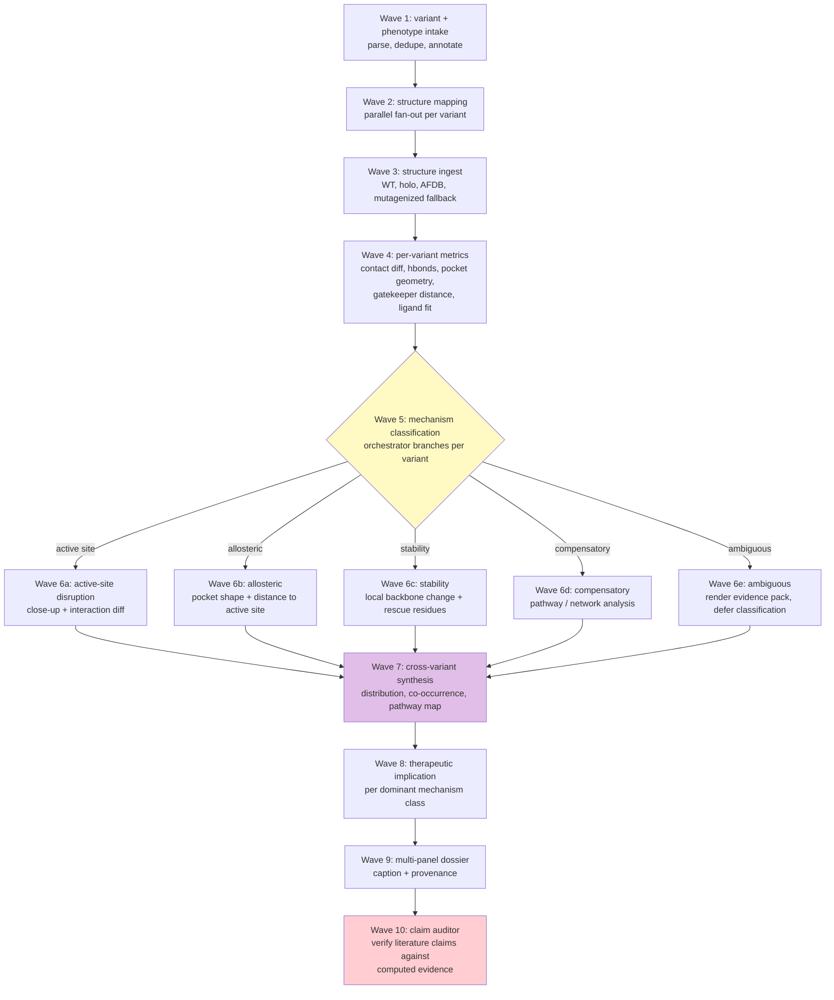

# Campaign: Mechanistic Variant Atlas

The Mechanistic Variant Atlas is a sibling campaign pattern to the GeneCluster flagship in this public skill. It shows that the same contract loop (source ledger, query resolution, route card with claim ceiling, evidence scoring, claim audit, dossier) can host a variant-effect campaign as well as a gene cluster discovery campaign. It is also the work that justifies a Symphony + Linear orchestration layer instead of a single Codex session for variant-effect problems.

## Goal

Given a curated list of variants and a phenotype label, produce a paper-grade dossier that explains, per variant, the structural mechanism most consistent with the phenotype, classified into mechanism families with confidence scoring, and audited against literature claims.

The example campaign in `examples/egfr-resistance-v1/` runs against EGFR drug-resistance variants in non-small-cell lung cancer.

## Why This Campaign Is Symphony-Native

The campaign passes every filter in `docs/superpowers.md`:

| Filter | How this campaign exercises it |
| --- | --- |
| Content-dependent branching | Wave 5 routes each variant to a different Wave 6 subworker based on its computed metrics. The DAG shape depends on the data, not the template. |
| Cross-issue meta-reasoning | Wave 7 holds all variant outcomes simultaneously to detect dominant mechanism classes and rank therapeutic implications. |
| Multi-claim ledger | 8-15 variants with 5-7 evidence types each = 50-100 distinct verifiable claims. |
| Provenance | Every panel traces back to PDB ID, render command, contour or palette, and the issue that produced it. |
| Replay-ready | When a new EGFR structure deposits or a new variant is added, only the affected branch reruns. |
| External feedback hook | Wave 8 emits "candidate counter-strategy" outputs that a wet-lab partner can act on. Future Wave 11 ingests assay results. |

A single Codex session cannot do this. A single Snakemake DAG cannot do this. The orchestrator must reason about per-variant evidence to pick the right downstream worker.

## Tier Boundary For v1

V1 (Mechanistic Variant Atlas Lite) runs on Tier A capabilities only. No new prediction model installs are required.

| Lane | v1 source | Tier | Notes |
| --- | --- | --- | --- |
| Wild-type structures | RCSB PDB fetch | A | curl + BioPython parse |
| Mutant structures (when deposited) | RCSB PDB fetch | A | curl + BioPython parse |
| Predicted variant structures | AlphaFold DB fetch when available | A | static download, no inference |
| Predicted variants not in AFDB | AlphaFold Server (free tier, 30/day) | A | manual, but free and metered |
| In silico mutagenesis fallback | PyMOL `mutate` | A | adequate for active-site geometry, not for fold prediction |
| Contact / hbond / pocket metrics | BioPython, PyMOL, fpocket (5-min install) | A | locally computable |
| Mechanism classifier | rule-based (this document) | A | not an ML model |
| Panels | PyMOL ray, ChimeraX REST | A | already installed |
| Caption + provenance | text generation worker | A | uses the existing manifest |
| Boltz-2 affinity confirmation | promoted from Tier B | B | optional once installed |
| BioEmu allosteric ensembles | promoted from Tier D | D | future-only |

V1 does not run BoltzGen, RFdiffusion, BioEmu, or full AF3 locally. Those lanes are documented as future v2 extensions in the relevant waves.

## Campaign DAG



## Waves

Each wave is a Linear issue or set of parallel issues. Each issue body conforms to `references/contract-template.md` and must pass `scripts/preflight_check.py`.

### Wave 1: variant and phenotype intake

Purpose: parse curated variant list, normalize identifiers, attach phenotype label, emit a versioned variant table for downstream waves.

Parallelism: single worker.

Branching: none.

Inputs: `examples/egfr-resistance-v1/variants.yaml`, `examples/egfr-resistance-v1/claims.yaml`.

Outputs: `intake/variant_table.json`, `intake/intake_report.md`.

Example issue body:

````markdown
## Summary

Parse the EGFR variant list and literature-claim file into a normalized variant table for the Mechanistic Variant Atlas.

## Inputs

- `examples/egfr-resistance-v1/variants.yaml` - curated EGFR resistance variants with HGVS, COSMIC, drug context, phenotype
- `examples/egfr-resistance-v1/claims.yaml` - literature claims for the wave-10 auditor

## Acceptance Criteria

- [ ] `intake/variant_table.json` exists and validates against the campaign's intake schema
- [ ] every variant in variants.yaml has a row with HGVS, UniProt position, drug context, phenotype, and claim references
- [ ] `intake/intake_report.md` lists per-variant counts, missing fields, and skipped entries with reasons

## Validation Commands

```bash
python3 skills/biosymphony/scripts/campaign_intake.py \
  --variants skills/biosymphony/examples/egfr-resistance-v1/variants.yaml \
  --claims skills/biosymphony/examples/egfr-resistance-v1/claims.yaml \
  --out intake/
python3 -c "import json,sys; d=json.load(open('intake/variant_table.json')); assert len(d['variants'])>=8, 'too few variants'"
```

## Touched Areas

- `intake/variant_table.json` - normalized intake output
- `intake/intake_report.md` - intake summary

## Dependencies

Blocked by: none

## Risk Notes

- Do not store private patient identifiers, unpublished variant lists, or secret literature in this artifact.
- Record citation IDs for every claim so the wave-10 auditor can trace evidence.

## Complexity

tier: small

<!-- symphony:schema
schema_version: 1
touched_areas:
  - intake/
complexity: small
-->
````

### Wave 2: structure mapping

Purpose: for each variant, query RCSB PDB and AlphaFold DB to build a candidate structure list (apo, holo with each relevant TKI, multimer states).

Parallelism: one issue per variant. With 10 variants this is 10 parallel workers.

Branching: none at issue level. Each worker decides locally which structure types to fetch.

Inputs: `intake/variant_table.json`.

Outputs: `mapping/<variant_id>/candidate_structures.json` per variant.

Example issue body (parameterized per variant):

````markdown
## Summary

Query RCSB PDB and AlphaFold DB for structures relevant to EGFR variant T790M. Build a candidate structure list with apo, holo, and TKI-bound complexes covering at least gefitinib, erlotinib, and osimertinib contexts where deposited.

## Inputs

- `intake/variant_table.json` - normalized variant table from Wave 1
- `T790M` - target variant identifier in the table

## Acceptance Criteria

- [ ] `mapping/T790M/candidate_structures.json` exists with at least one apo and one holo structure ID, or an explicit "no holo deposited" record with citation
- [ ] every PDB row records resolution, ligand IDs, chain mapping, and deposition date
- [ ] `mapping/T790M/mapping_report.md` lists what was found and what was skipped with reason

## Validation Commands

```bash
python3 skills/biosymphony/scripts/structure_query.py \
  --variant T790M \
  --table intake/variant_table.json \
  --out mapping/T790M/
python3 skills/biosymphony/scripts/figure_manifest_check.py \
  mapping/T790M/candidate_structures.json --schema-name candidate_structures
```

## Touched Areas

- `mapping/T790M/` - per-variant structure candidate listing

## Dependencies

Blocked by: I-W1-INTAKE

## Risk Notes

- Do not include unpublished structures or private deposits.
- Note any structures behind embargo or with non-standard ligand IDs as caveats, not as silent failures.

## Complexity

tier: small

<!-- symphony:schema
schema_version: 1
touched_areas:
  - mapping/T790M/
complexity: small
-->
````

### Wave 3: structure ingest

Purpose: fetch the chosen structures, validate file integrity, normalize chains, and produce ingest-clean files. Where no deposited mutant exists, run PyMOL `mutate` against the WT to produce a mutagenized model with explicit caveat.

Parallelism: one issue per (variant, structure) pair selected in Wave 2. Tens to a few dozen parallel workers depending on coverage.

Branching: small. If AFDB has the variant, ingest it. If not and no PDB exists, fall back to PyMOL mutagenesis with a `mutagenized_fallback: true` flag on the artifact.

Inputs: `mapping/<variant>/candidate_structures.json`.

Outputs: `structures/<variant>/<pdb_or_label>.cif` and `.json` metadata per structure.

Each ingest issue records source, resolution, license note, hash, and "predicted" or "experimental" tag. The flag survives into the figure manifest.

### Wave 4: per-variant structural metrics

Purpose: for each variant, compute the structural metrics that feed the Wave 5 mechanism classifier. This is the largest fan-out wave.

Parallelism: per-variant per-metric. With 10 variants and 5 metrics, 50 parallel issues. All metrics are locally computable on Tier A.

Metrics (all Tier A):

1. Contact diff between WT and variant: residue pairs gained or lost using a 5 Å cutoff.
2. Hbond diff in the active site and at the kinase hinge: PyMOL `find_pairs` or BioPython geometry.
3. Pocket geometry: pocket volume and shape change in and adjacent to the ATP / TKI binding cleft. fpocket if installed, falls back to convex-hull volume of binding-site residues.
4. Gatekeeper-residue geometry: position 790 in EGFR. Distance from gatekeeper Cα to bound TKI heavy atoms; van der Waals overlap.
5. Drug-pocket interaction loss: per TKI co-complex, count contacts between the drug heavy atoms and residues within 4 Å, compared between WT and variant.

Each metric is a separate issue per variant so review gates can reject any one without losing the rest.

Outputs: `metrics/<variant>/<metric>.json` per (variant, metric) pair plus a per-variant `metrics/<variant>/summary.json`.

### Wave 5: mechanism classification (the branching wave)

Purpose: classify each variant into a mechanism family using a rule-based classifier. Output a per-variant mechanism call with confidence.

Parallelism: one issue per variant.

Branching: yes. The output of this wave determines which Wave 6 subworker activates for each variant.

Mechanism families:

- `active_site`: TKI binding directly disrupted. Strong loss of TKI contacts at residues within 4 Å of the bound drug, or large gatekeeper VDW overlap, or covalent-binding residue mutation (for example C797S vs osimertinib).
- `allosteric`: TKI binding indirectly disrupted. Substantial pocket-shape change at the binding cleft without direct TKI-contact residue mutation, or large change in αC-helix orientation, or P-loop reorientation (for example exon 19 deletions, exon 20 insertions).
- `stability`: variant destabilizes the local fold. Significant backbone deviation in a structurally critical region, large hbond network loss, or known ddG-impacting position. Detectable via local RMSD plus contact loss in a non-binding-site region.
- `compensatory`: variant has minor direct effect but is known or computed to act through a network or pathway change. Phenotype-positive but evidence-weak; flag for Wave 6d.
- `ambiguous`: evidence is split or below confidence threshold. Routed to Wave 6e for evidence-pack rendering and deferred classification.

Branching rule (executable pseudocode):

```python
def classify(variant_metrics):
    contacts = variant_metrics["drug_contact_loss"]
    gatekeeper = variant_metrics["gatekeeper_overlap"]
    covalent = variant_metrics["covalent_residue_mutated"]
    pocket = variant_metrics["pocket_shape_delta"]
    backbone = variant_metrics["local_backbone_rmsd"]
    direct_active_residue = variant_metrics["direct_tki_contact_residue"]

    evidence = []

    if covalent:
        evidence.append(("active_site", 0.95, "covalent residue mutated"))
    if direct_active_residue and contacts > 3:
        evidence.append(("active_site", 0.85, f"{contacts} drug contacts lost"))
    if gatekeeper > 1.5:
        evidence.append(("active_site", 0.9, f"gatekeeper VDW overlap {gatekeeper:.1f} Å"))
    if pocket > 0.25 and not direct_active_residue:
        evidence.append(("allosteric", 0.7, f"pocket shape Δ {pocket:.2f}"))
    if backbone > 1.5 and not direct_active_residue:
        evidence.append(("stability", 0.65, f"local RMSD {backbone:.2f} Å"))

    if not evidence:
        return ("compensatory", 0.4, "no direct structural effect computed")

    evidence.sort(key=lambda e: e[1], reverse=True)
    top = evidence[0]
    if len(evidence) >= 2 and abs(top[1] - evidence[1][1]) < 0.1:
        return ("ambiguous", top[1], f"top-2 tie: {top[2]} vs {evidence[1][2]}")
    return top
```

This logic ships in `references/campaigns/_branch-logic-mva.md` as the campaign's reviewable rule book, open to inspection. The orchestrator can re-classify by re-running this function against updated metrics; the variants whose classification changes get a re-render in Wave 6.

### Wave 6: per-mechanism evidence panels

Five sub-waves. Each variant flows into exactly one based on Wave 5. Subworkers run in parallel within their family.

#### Wave 6a: active-site disruption

Render: close-up of variant residue + bound TKI + interaction surface, side-by-side with WT. Annotate gained/lost contacts. Caption captures contact-loss count and gatekeeper distance.

Tools: PyMOL ray render with show_as sticks for the variant residue and the TKI; ChimeraX optional for surface coloring.

Validation: PNG nonblank, 2200x1700 minimum, exact contacts list embedded as a sidecar JSON.

#### Wave 6b: allosteric

Render: pocket-shape comparison before and after, with αC-helix orientation overlay and the binding cleft outlined. Caption captures pocket-volume delta and helix angle.

Tools: ChimeraX REST for surface and helix-axis annotations, PyMOL fallback.

#### Wave 6c: stability

Render: local backbone overlay highlighting the deviation region, with hbond network loss diagram. Caption captures region RMSD and hbonds lost.

#### Wave 6d: compensatory

Render: pathway map placing the variant in its known signaling or regulatory network, with a structural panel for any known partner-interaction residue. Phenotype evidence is weighted higher than direct structural evidence.

#### Wave 6e: ambiguous

Render: a four-panel evidence pack showing all candidate-mechanism evidence side by side. Caption explicitly states the classifier was unable to choose with confidence and lists which evidence types tied.

### Wave 7: cross-variant synthesis

Purpose: hold all per-variant Wave-6 outputs together and produce campaign-level patterns.

Parallelism: single orchestrator-driven issue.

Outputs:

- `synthesis/mechanism_distribution.json`, count and percent per mechanism family.
- `synthesis/cooccurrence.json`, variant pairs that recur together in the literature/dataset.
- `synthesis/resistance_pathway_map.svg`, a network diagram (per-drug → variant → mechanism family).
- `synthesis/synthesis_report.md`, narrative summary.

This is exactly the wave a single Codex session cannot do well. The orchestrator integrates outcomes across 10+ issues to produce campaign-level claims.

### Wave 8: therapeutic implication draft

Purpose: for the dominant mechanism class(es), draft candidate counter-strategies. This is the wet-lab feedback hook (the north star).

Examples of generated suggestions, keyed to mechanism class:

- `active_site` dominant: suggest a covalent-warhead chemotype that does not depend on the mutated residue, or a different binding-pose chemotype.
- `allosteric` dominant: suggest screening allosteric inhibitors, with the perturbed pocket shape as a target descriptor.
- `stability` dominant: suggest stabilizing back-pocket binders or chaperone-modulating strategies.
- `compensatory` dominant: suggest network-target combination therapy.

Outputs: `therapy/strategy_brief.md`, `therapy/candidate_chemotypes.yaml`. Both are explicit drafts marked "computational hypothesis, not validated."

### Wave 9: multi-panel dossier

Purpose: assemble the final paper-grade figure dossier with all panels, captions, and provenance.

Parallelism: a small set of assembly + caption + QA issues.

Outputs:

- `figure-dossier/figure_manifest.json`, validated by `figure_manifest_check.py`.
- `figure-dossier/panels/`, all rendered panels.
- `figure-dossier/sessions/`, saved PyMOL .pse and ChimeraX .cxs sessions.
- `figure-dossier/caption_draft.md`.
- `figure-dossier/provenance.md`.
- `figure-dossier/storyboard.md`.

### Wave 10: claim auditor

Purpose: this is the campaign's most ambitious feature. For every literature claim in `claims.yaml`, the auditor verifies the claim against the campaign's own computed evidence.

Parallelism: one issue per claim.

Branching: yes. Each claim is classified into:

- `supported`, campaign evidence is consistent with the claim within stated confidence.
- `qualified`, campaign evidence partially supports the claim or only under stated conditions.
- `not_supported`, campaign evidence contradicts the claim within the campaign's resolution.
- `untestable`, the claim makes a prediction the campaign cannot evaluate (for example, kinetic or in-vivo claims). This is a documentation outcome, not a failure.

Each audit issue produces:

- `audit/<claim_id>/audit.json`, verdict, evidence references, confidence.
- `audit/<claim_id>/audit.md`, narrative paragraph for the dossier.

Concrete example: claim `T790M_gatekeeper_clash`:

> "T790M acts as a gatekeeper that sterically clashes with gefitinib and erlotinib (Kobayashi et al., NEJM 2005)."

The auditor pulls Wave 4 metrics for T790M's gatekeeper VDW overlap with gefitinib/erlotinib and Wave 6a's contact-loss count. If the gatekeeper VDW overlap exceeds the threshold and the drug-contact loss is nontrivial, the verdict is `supported` with references to the metrics issues. If the gatekeeper-side metric is small but contacts are still lost, the verdict is `qualified` with the appropriate caveat.

The audit verdicts feed back into the dossier as a final "Claims and evidence" appendix, so the campaign doesn't just produce a figure, it produces a position on the structural claims in the literature.

Wave 10 is the wave that cleanly separates BioSymphony from "smart pipeline." The orchestrator reasons about its own outputs to verify external claims.

## Issue counts and parallelism

A v1 EGFR run with 10 variants:

- Wave 1: 1 issue
- Wave 2: 10 issues (per variant), fully parallel
- Wave 3: ~20-30 issues (per variant per structure), fully parallel
- Wave 4: ~50 issues (per variant per metric), fully parallel
- Wave 5: 10 issues (per variant), fully parallel
- Wave 6: 10 issues split across 6a-e, parallel within sub-wave
- Wave 7: 1 issue (orchestrator-driven)
- Wave 8: 1-3 issues
- Wave 9: 4-6 issues (assembly, caption, QA, manifest)
- Wave 10: 10-30 issues (per claim), fully parallel

Total: 100-150 issues for a v1 EGFR run.

`max_concurrent_agents: 1` for the first dry run, then escalate to 3 for the wave-4 fanout.

## Capability gating

Before any campaign run, run:

```bash
python3 skills/biosymphony/scripts/capability_probe.py --json
```

The probe must report:

- PyMOL app path resolved
- ChimeraX app path resolved
- network access for RCSB PDB and AFDB endpoints
- Python 3 with json, urllib, optional fpocket binary

Tier B/C/D promotion paths are documented per wave but not required for v1.

## Dry run vs live run

The campaign ships in two modes:

- `--dry-run` mode emits only the Linear issue bodies and the campaign manifest, without dispatching to Symphony. The bodies are validated by `preflight_check.py`. This is the recommended first run.
- live mode seeds Linear issues with the worker-safe Symphony Linear skill, sets blocker relations, and lets Symphony pick up Wave 1 only. Subsequent waves are gated by orchestrator review.

V1 ships with the dry-run path proven and the live path scaffolded but unproven.

## What v1 explicitly does not do

- run new structure prediction beyond AFDB lookup and PyMOL mutagenesis
- run BoltzGen, BioEmu, RFdiffusion, or full AF3 locally
- ingest wet-lab assay data
- close the design-build-test-learn loop
- claim quantitative ddG values without PyRosetta or comparable tooling

These are explicit v2 extensions and should not be promised in v1 dossiers.

## Pointers

- Campaign data: `examples/egfr-resistance-v1/`
- Branch logic: this document, Wave 5 section
- Contract template: `references/contract-template.md`
- Manifest schema: `references/figure-manifest.schema.json`
- Capability tiers: `references/capability-matrix.md`
- Validators: `scripts/preflight_check.py`, `scripts/figure_manifest_check.py`, `scripts/capability_probe.py`
